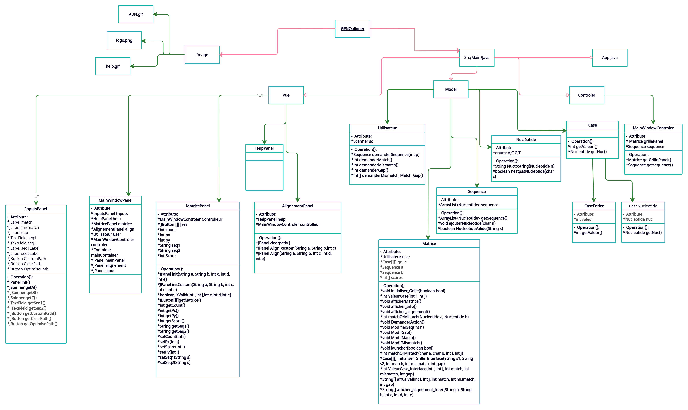

# GENOaligner
*Outil d'analyse et d'alignement de séquences génomiques*


## Présentation
GENOaligner (Genomics Aligner) est un outil qui sert à représenter l'algorithme d'alignement de Needleman-Wunsch. Cette technique est couramment
utilisé par les
bio-informaticiens pour faire un alignement globale maximale de deux séquences génomiques afin de ressortir
les régions homologues.

Ce projet a été réalisé pour le module de Projet de Programmation en Deuxième année de licence Informatique à l'Université de Paris Cité.

Contributeurs :
* Ben Abdallah Montassar
* Bouzid Lyna 
* Mohamed Halim Nafyssata
* Mkouboi Mounia  
* Nur Akbas Aleysa


## Structure du projet



   - `Src`: dossier qui contient le code sources représenté par les trois packages Model, Vue et Controller.
   - `Image`: dossier qui contient les images utilisées.


## Exécution du code

#### Récupérer le projet :

1. Clonez le projet depuis le dépôt distant :

SSH:
```
git@gaufre.informatique.univ-paris-diderot.fr:projet-s4/GENOaligner.git
```
HTTP:
```
git clone https://gaufre.informatique.univ-paris-diderot.fr/projet-s4/GENOaligner.git
```


2. Naviguez dans le dossier ainsi cloné :
```
cd GENOaligner
```


#### Lancer le Logiciel :
1. Compiler :
Sur Windows :
```
gradlew build
```

Sur Linux / MacOS :
```
chmod +x gradlew
./gradlew build
```

2. Lancer :
Sur Windows :
```
java -jar build\libs\GENOaligner.jar
```

Sur Linux / MacOS :
```
java -jar ./build/libs/GENOaligner.jar
```
