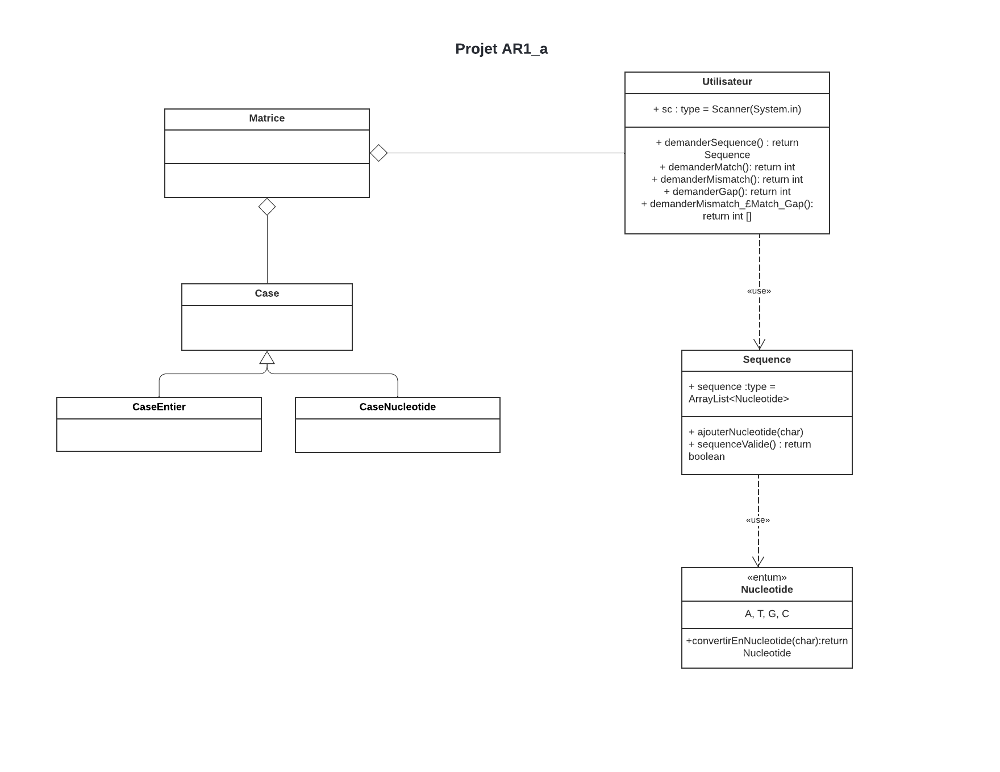

# GENOaligner

Projet du module de Projet de Programmation en 2e année de licence en Informatique à l'Université Paris Cité.


## Présentation
GENOaligner (Genomics Aligner) est un outil qui sert à représenter l'algorithme d'alignement de Needleman-Wunsch. Cette technique est couramment
utilisé par les
bio-informaticiens pour faire un alignement globale maximale de deux séquences génomiques afin de ressortir
les régions homologues.

Contributeurs :
* Ben Abdallah Montassar
* Bouzid Lyna 
* Mohamed Halim Nafyssata
* Mkouboi Mounia  
* Nur Akbas Aleysa


## Structure du projet



Modèle en trois packages (Model, Vue, Controller).


#### Model

#### Vue

#### Controller


## Exécution du code
### EN IDE
* soit en IG en executant la classe MainWindowPanel.java 
* soit en console avec la classe Matrice.java


### HORS IDE
#### Récupérer le projet :
1. Clonez le projet depuis le dépôt distant :
```
git clone https://gaufre.informatique.univ-paris-diderot.fr/projet-s4/projet-ar1.git
```

2. Naviguez dans le dossier ainsi cloné :
```
cd projet-ar1
```


#### Lancer le Logiciel :
1. Compiler :
Sur Windows :
```
gradlew build
```

Sur Linux / MacOS :
```
chmod +x gradlew
./gradlew build
```

2. Lancer :
Sur Windows :
```
java -jar build\libs\projet-ar1.jar
```

Sur Linux / MacOS :
```
java -jar ./build/libs/projet-ar1.jar
```
